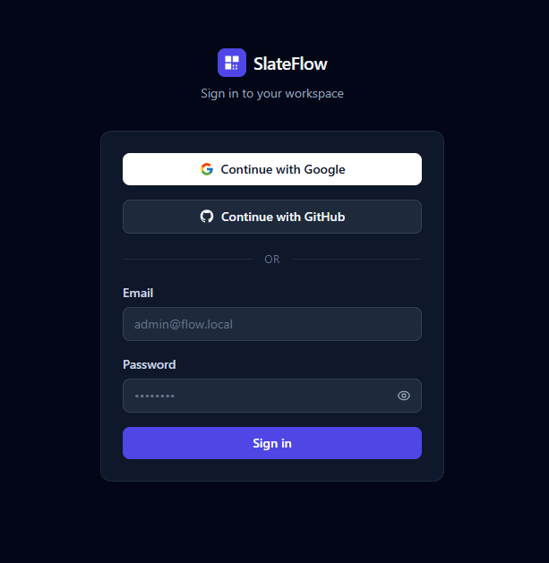
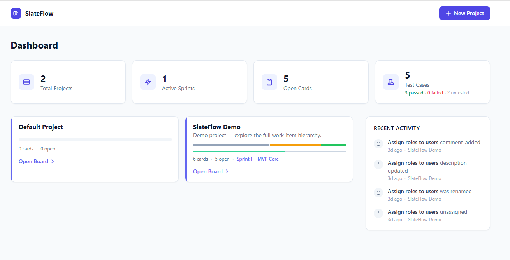
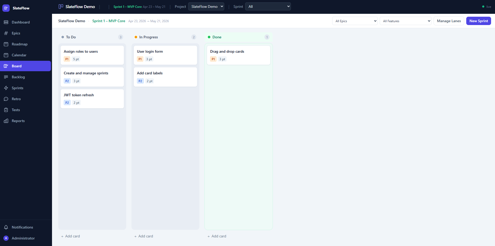
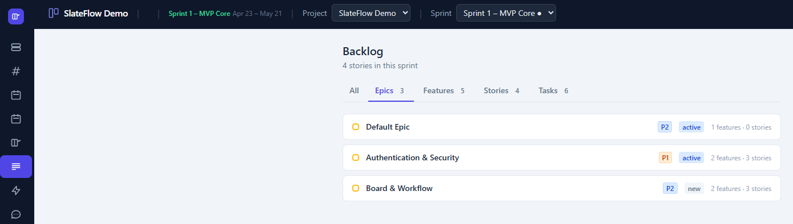
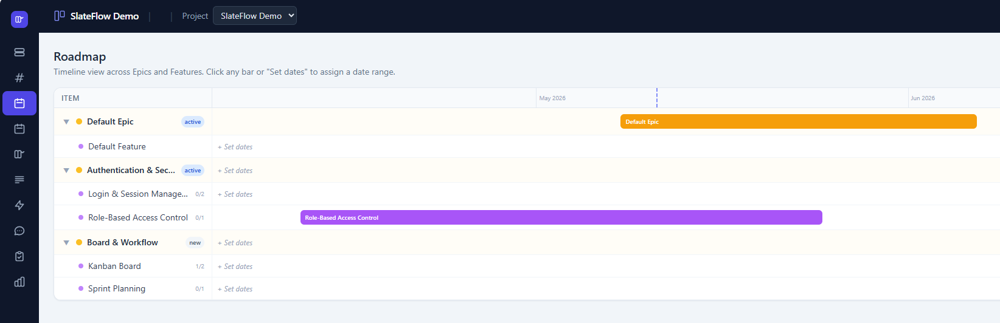
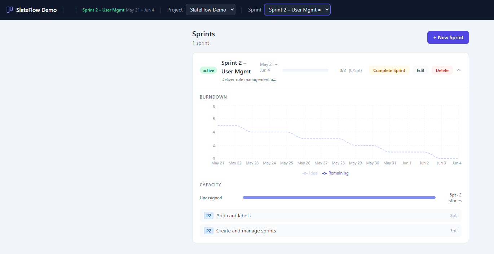
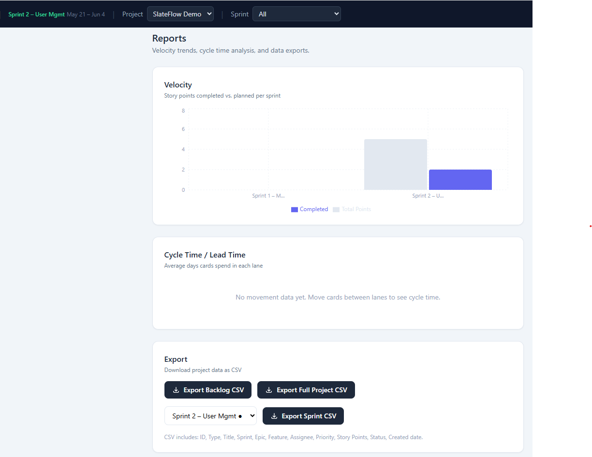
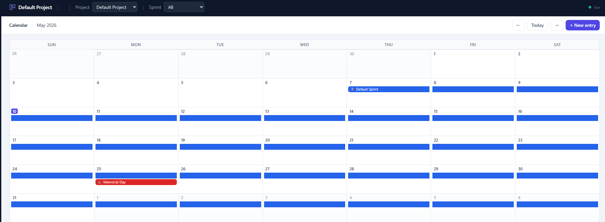
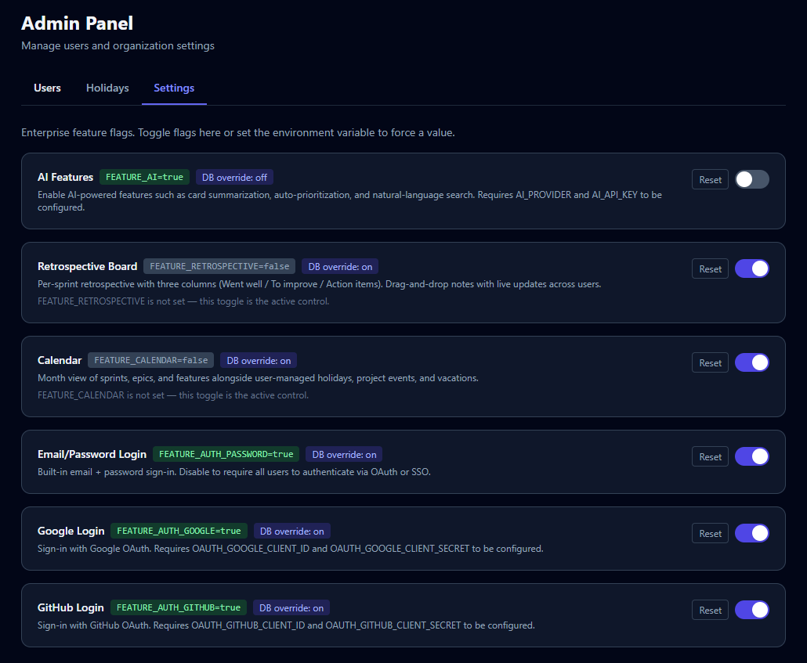

# SlateFlow

SlateFlow is a self-hosted, single-container project management platform for agile teams. It pairs a drag-and-drop Kanban board with the full Hierarchy (Project → Sprint → Epic → Feature → Story → Task), sprint planning with burndown, a per-sprint Retrospective Board, a calendar that blends sprints/epics/features with team holidays, events, and vacations, a Gantt-style roadmap, velocity / cycle-time / capacity reports, test case management, real-time collaboration over Server-Sent Events, multi-user RBAC at global / project / epic level, and AI card summarisation across Claude, Gemini, OpenAI, Azure OpenAI, and Ollama. SQLite + Hono + React in a single Docker image — no external services required.

## Table of Contents

- [Screenshots](#screenshots)
- [Features](#features)
- [Quick Start](#quick-start)
- [Docker Quick Start](#docker-quick-start)
- [Scripts](#scripts)
- [Stack](#stack)
- [Contributing](#contributing)
- [Support](#support)
- [License](#license)

## Screenshots

| | |
|---|---|
|  |  |
|  |  |
|  |  |
|  |  |

<details>
<summary>Admin panel</summary>

| | |
|---|---|
|  |  |
|  | |

</details>

> Full list of screenshots: [`screenshots/`](screenshots/)

## Features

- **Dashboard** — project overview with stats (open cards, active sprints) and a cross-project activity feed
- **Kanban board** — swim lanes and cards with full drag-and-drop reordering; manage lanes inline
- **Lane presets** — pick a workflow template (e.g. Scrum, Kanban) when creating a project, or define custom lanes
- **Sprint management** — create, activate, and complete sprints; burndown charts per sprint
- **Backlog** — full CRUD on unassigned cards (create, click-to-edit via modal, delete); cards grouped by swim lane; move to any sprint in one click
- **Drag-and-drop** — powered by `@dnd-kit` with pointer sensor support
- **Activity log** — automatic `create`, `update`, and `move` events per card
- **Test management** — attach test cases to cards; group into test suites; record pass/fail/blocked runs; track status with a per-card summary bar
- **Labels & comments** — tag cards and leave threaded comments; `@mention` notifications
- **Multi-user with RBAC** — JWT auth (httpOnly cookie); roles at global, project, and epic level
- **Flexible login methods** — email/password, Google OAuth, and GitHub OAuth, each independently toggleable via feature flags (`FEATURE_AUTH_PASSWORD`, `FEATURE_AUTH_GOOGLE`, `FEATURE_AUTH_GITHUB`); identities stored in a `user_identities` table that's ready for SSO
- **Real-time updates** — Server-Sent Events stream board mutations and notifications to every connected client
- **AI features** — card summarisation powered by a provider-agnostic interface; supports Anthropic Claude, Google Gemini, OpenAI, Azure OpenAI, and Ollama; gated by `FEATURE_AI=true`
- **Retrospective Board** — per-sprint reflection with three fixed columns (Went well / To improve / Action items) and live drag-and-drop reorder; gated by `FEATURE_RETROSPECTIVE=true`
- **Calendar** — month view of sprints, epics, and features alongside super-admin-managed global holidays, project events, and per-user vacations; gated by `FEATURE_CALENDAR=true`
- **Self-host** — single Docker container, SQLite database on a named volume; no external services required

### Planning & Visibility
- **Roadmap / timeline view** — Gantt-style view across Epics and Features with date ranges
- **Story dependencies** — "blocks / blocked by" relationships between stories
- **Capacity planning** — assignee workload view per sprint (story points per person)

### Reporting
- **Velocity chart** — story points completed per sprint, trend over time
- **Cycle time / lead time** — how long cards spend in each lane
- **CSV export** — backlog, sprint report, or full project snapshot as CSV

## Quick Start

**Prerequisites:** Node.js 20+

```bash
git clone https://github.com/your-org/slateflow.git
cd slateflow
npm install
npm run dev
```

| URL | What |
|-----|------|
| http://localhost:5173 | Kanban board (React + Vite HMR) |
| http://localhost:3000 | REST API (Hono) |

The SQLite database (`server/slateflow.db`) is created and seeded with a demo project on first boot.

## Docker Quick Start

**Prerequisites:** Docker and Docker Compose

```bash
# Copy and edit env vars (required if you want OAuth, AI, or to change SECRET/PORT).
# The dev server reads this file at startup; Docker passes through anything set
# here via docker-compose.yml.
cp .env.example .env

# Build and start on port 3000
docker-compose up -d
```

Open http://localhost:3000. The database is stored in the `slateflow-data` Docker volume and survives container restarts.

```bash
docker-compose down          # stop
docker-compose build         # rebuild after source changes
```

If port 3000 is already in use, see [CONTRIBUTING.md](CONTRIBUTING.md#freeing-port-3000) for PowerShell and Bash recipes to free it.

## Scripts

| Command | Description |
|---------|-------------|
| `npm run dev` | Start client + server concurrently |
| `npm run dev -w server` | Server only (tsx watch, port 3000) |
| `npm run dev -w client` | Client only (Vite HMR, port 5173) |
| `npm run build` | Production build (client + server) |
| `npm run lint -w client` | ESLint on the client workspace |

## Stack

| Layer | Tech |
|-------|------|
| Frontend | React 18, Vite 5, TypeScript, Tailwind CSS v3, react-router-dom v7, recharts |
| State | Zustand, react-hot-toast |
| HTTP client | axios + native fetch |
| Drag-and-drop | @dnd-kit/core + @dnd-kit/sortable |
| Backend | Node.js, Hono 4, TypeScript, tsx, Zod |
| Auth | JWT in httpOnly cookie (`sf_token`), bcrypt |
| Real-time | Server-Sent Events (no broker) |
| Database | SQLite (better-sqlite3), WAL mode |
| Monorepo | npm workspaces |
| Container | Docker + Docker Compose (single image) |

## Contributing

Contributions are welcome! Please read [CONTRIBUTING.md](CONTRIBUTING.md) before opening a pull request.

## Support

For issues, questions, or contributions:

- Open an issue on [GitHub](https://github.com/your-org/slateflow/issues)
- Contact: [ather.techie@gmail.com](mailto:ather.techie@gmail.com)

Feedback is always appreciated — if this project has been useful to you, please let the author know via email.

## License

[MIT](LICENSE)
