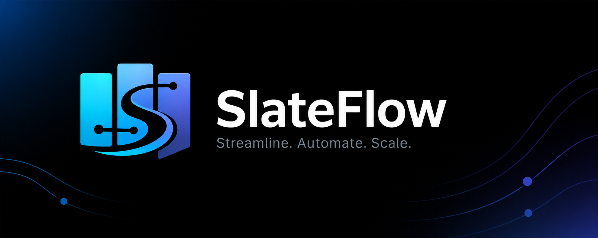
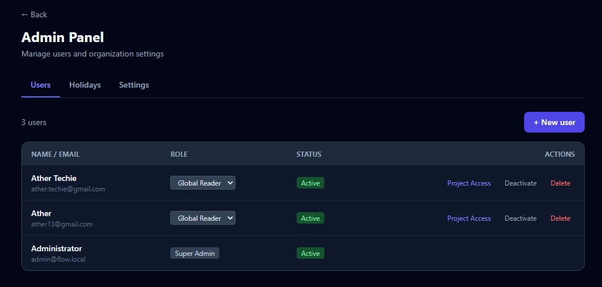
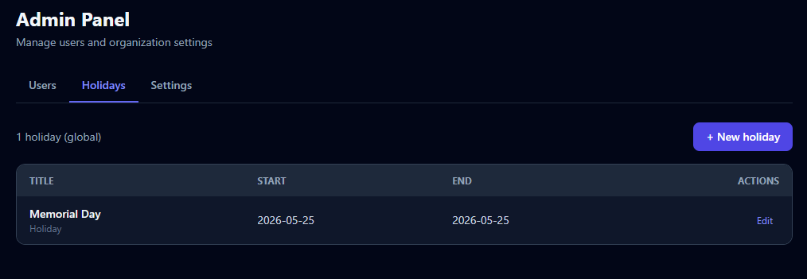

# SlateFlow


SlateFlow is a self-hosted, AI-powered agile project management platform built for modern engineering teams. Delivered as a single-container solution, it combines a drag-and-drop Kanban board with a complete agile hierarchy (Project → Sprint → Epic → Feature → Story → Task), sprint planning with burndown tracking, retrospective boards, roadmap planning, velocity/cycle-time/capacity reports, test case management, and real-time collaboration using Server-Sent Events.

SlateFlow also supports enterprise-grade RBAC at global, project, and epic levels, while integrating with leading AI platforms and models including Anthropic Claude, Google Gemini, OpenAI OpenAI, Microsoft Azure OpenAI, and Ollama Ollama for features like AI-powered card summarization and workflow enhancement. Built with SQLite, Hono, and React inside a single Docker image, it requires no external services, making it a lightweight yet powerful alternative to tools like Jira and Azure DevOps.

## Table of Contents

- [Screenshots](#screenshots)
- [Features](#features)
- [Quick Start](#quick-start)
- [Docker Quick Start](#docker-quick-start)
- [Scripts](#scripts)
- [Stack](#stack)
- [Contributing](#contributing)
- [Support](#support)
- [License](#license)

## Screenshots

| | |
|---|---|
|  |  |
|  |  |
|  |  |
|  |  |

<details>
<summary>Admin panel</summary>

| | |
|---|---|
|  |  |
|  | |

</details>

> Full list of screenshots: [`screenshots/`](screenshots/)

## Features

- **Dashboard** — project overview with stats (open cards, active sprints) and a cross-project activity feed
- **Kanban board** — swim lanes and cards with full drag-and-drop reordering; manage lanes inline
- **Lane presets** — pick a workflow template (e.g. Scrum, Kanban) when creating a project, or define custom lanes
- **Sprint management** — create, activate, and complete sprints; burndown charts per sprint
- **Backlog** — full CRUD on unassigned cards (create, click-to-edit via modal, delete); cards grouped by swim lane; move to any sprint in one click
- **Story tasks** — sub-items on any story card; to-do / in-progress / done toggle with an inline progress bar in the card modal
- **Card attachments** — upload files and images directly to story cards; preview images inline; download or delete attachments (gated by `FEATURE_CARD_ATTACHMENTS`)
- **Card priority levels** — assign priority (Critical / High / Medium / Low) to every card with color indicators for quick visual scanning
- **Due dates** — set due dates on cards and tasks; hourly background reminders for upcoming or overdue items; email notifications for assigned users
- **Drag-and-drop** — powered by `@dnd-kit` with pointer sensor support
- **Activity log** — automatic `create`, `update`, and `move` events per card
- **Test management** — attach test cases to cards; group into test suites; record pass/fail/blocked runs; track status with a per-card summary bar
- **Labels & comments** — project-scoped colored labels; threaded comments with `@mention` support
- **Notifications** — in-app bell with unread count badge; real-time SSE delivery via Server-Sent Events; email notifications for mentions, assignments, and due date reminders (SMTP-based, per-user opt-out preference); triggered by `@mention` in comments, story assignment, and due dates
- **Multi-user with RBAC** — JWT auth (httpOnly cookie); three role layers: global (`super_admin` / `global_reader`), project (`project_admin` / `contributor` / `reader`), and epic (`epic_admin` / `contributor` / `reader`); project admins have a dedicated `/projects/:id/admin` panel (Members, Settings, Lanes) without needing super_admin
- **Flexible login methods** — email/password, Google OAuth, and GitHub OAuth, each independently toggleable via feature flags (`FEATURE_AUTH_PASSWORD`, `FEATURE_AUTH_GOOGLE`, `FEATURE_AUTH_GITHUB`); identities stored in a `user_identities` table that's ready for SSO
- **Real-time updates** — Server-Sent Events stream board mutations and notifications to every connected client
- **AI features** — gated by `FEATURE_AI=true`; provider-agnostic across Anthropic Claude, Google Gemini, OpenAI, Azure OpenAI, and Ollama:
  - *Card summarisation* — generates a 2–3 sentence summary from a story's title and description
  - *Story generation from features* — generates 3–7 user story outlines from a feature's title and description (gated by `FEATURE_AUTO_STORY_GENERATION_AI`)
  - *Test case generation* — generates 3–5 test cases from a story's title and description (gated by `FEATURE_AUTO_TEST_CASE_GENERATION_AI`)
  - *Natural-language work-item creation* — type a sentence to create an epic, feature, story, task, project, sprint, or calendar event; AI returns an editable preview before confirming; available on the Board, Epics, Sprints, Calendar, and Dashboard pages
- **Retrospective Board** — per-sprint reflection with three fixed columns (Went well / To improve / Action items) and live drag-and-drop reorder; gated by `FEATURE_RETROSPECTIVE=true`
- **Calendar** — month view of sprints, epics, and features alongside super-admin-managed global holidays, project events, and per-user vacations; holidays support optional country and state/province tagging; calendar view lets users filter by country; gated by `FEATURE_CALENDAR=true`
- **GitHub & GitLab integration** — attach PR, MR, issue, or commit links to any story card; gated by `FEATURE_GITHUB_INTEGRATION` / `FEATURE_GITLAB_INTEGRATION`; webhook receivers (`POST /webhooks/github`, `POST /webhooks/gitlab`) automatically move linked cards to the done lane when a PR/MR is merged or close linked GitHub issues when the card moves to done; optional PAT for fetching titles on private repos
- **MCP (Model Context Protocol) Server** — expose SlateFlow to AI assistants (Claude, Cursor, Copilot, etc.) via standardized MCP tools; users generate named tokens for safe, audit-logged access; five independent feature flags control read, create, update, delete, and reporting operations (`FEATURE_READ_MCP`, `FEATURE_CREATE_MCP`, `FEATURE_UPDATE_MCP`, `FEATURE_DELETE_MCP`, `FEATURE_REPORT_MCP`); respects user RBAC so AI actions are scoped to user permissions
- **Comprehensive test suite** — unit tests for components, hooks, and stores using Vitest + React Testing Library; run with `npm run test` or watch mode with `npm run test:watch`; browser-level UI verification with MCP Playwright for testing real browser behaviors (Kanban DnD, modals, SSE real-time updates) via Claude Code's interactive browser-control tools
- **Self-host** — single Docker container, SQLite database on a named volume; no external services required

### Planning & Visibility
- **Roadmap / timeline view** — Gantt-style view across Epics and Features with date ranges
- **Story dependencies** — "blocks / blocked by" relationships between stories
- **User skills** — app-level and project-level skill tags on team members for resource planning
- **Capacity planning** — assignee workload view per sprint with committed capacity (story points per person) vs. actual; visual indicators for over-allocation
- **User profiles** — extended profile fields including work/home location (country, state, city), timezone, job title, department, phone, gender, and reporting manager for team context and resource planning

### Reporting
- **Velocity chart** — story points completed per sprint, trend over time, with average velocity calculation; velocity snapshots for completed sprints
- **Cycle time / lead time** — how long cards spend in each lane
- **Capacity report** — per-assignee workload with team skills and committed capacity
- **CSV export** — backlog, sprint report, or full project snapshot as CSV

## Quick Start

**Prerequisites:** Node.js 20+ 

Node : https://nodejs.org/en/download/archive/v20.20.1

```bash
git clone https://github.com/your-org/slateflow.git
cd slateflow
npm install
npm run dev
```

| URL | What |
|-----|------|
| http://localhost:5173 | Kanban board (React + Vite HMR) |
| http://localhost:3000 | REST API (Hono) |
| http://localhost:3000/api/docs | OpenAPI / Swagger documentation |
| http://localhost:3000/health | Health check endpoint |

The SQLite database (`server/slateflow.db`) is created and seeded with a demo project on first boot.

## Docker Quick Start

**Prerequisites:** Docker and Docker Compose

```bash
# Copy and edit env vars (required if you want OAuth, AI, or to change SECRET/PORT).
# The dev server reads this file at startup; Docker passes through anything set
# here via docker-compose.yml.
cp .env.example .env

# Build and start on port 3000
docker-compose up -d
```

Open http://localhost:3000. The database is stored in the `slateflow-data` Docker volume and survives container restarts.

```bash
docker-compose down          # stop
docker-compose build         # rebuild after source changes
```

If port 3000 is already in use, see [CONTRIBUTING.md](CONTRIBUTING.md#freeing-port-3000) for PowerShell and Bash recipes to free it.

## Scripts

| Command | Description |
|---------|-------------|
| `npm run dev` | Start client + server concurrently |
| `npm run dev -w server` | Server only (tsx watch, port 3000) |
| `npm run dev -w client` | Client only (Vite HMR, port 5173) |
| `npm run build` | Production build (client + server) |
| `npm run lint -w client` | ESLint on the client workspace |

# Run all tests
npm run test -w server

# Or individually
npx vitest run server/src/lib/auth.test.ts

## Stack

| Layer | Tech |
|-------|------|
| Frontend | React 18, Vite 5, TypeScript, Tailwind CSS v3, react-router-dom v7, recharts |
| State | Zustand, react-hot-toast |
| HTTP client | axios + native fetch |
| Drag-and-drop | @dnd-kit/core + @dnd-kit/sortable |
| Backend | Node.js, Hono 4, TypeScript, tsx, Zod |
| Auth | JWT in httpOnly cookie (`sf_token`), bcrypt |
| Real-time | Server-Sent Events (no broker) |
| Database | SQLite (better-sqlite3), WAL mode |
| Monorepo | npm workspaces |
| Container | Docker + Docker Compose (single image) |

## Contributing

Contributions are welcome! Please read [CONTRIBUTING.md](CONTRIBUTING.md) before opening a pull request.

## Support

For issues, questions, or contributions:

- Open an issue on [GitHub](https://github.com/your-org/slateflow/issues)
- Join the [Discord community](https://discord.gg/kSUE3CA9P)
- Contact: [ather.techie@gmail.com](mailto:ather.techie@gmail.com)

Feedback is always appreciated — if this project has been useful to you, please let the author know via email.

## License

[MIT](LICENSE)
